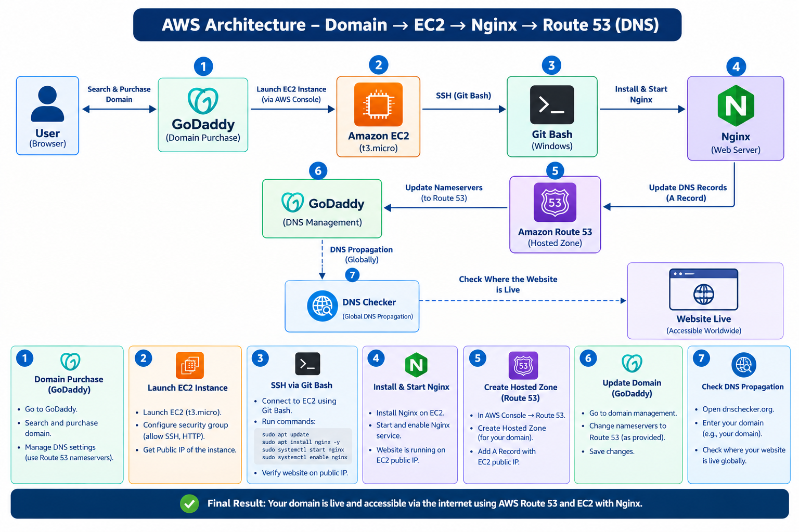
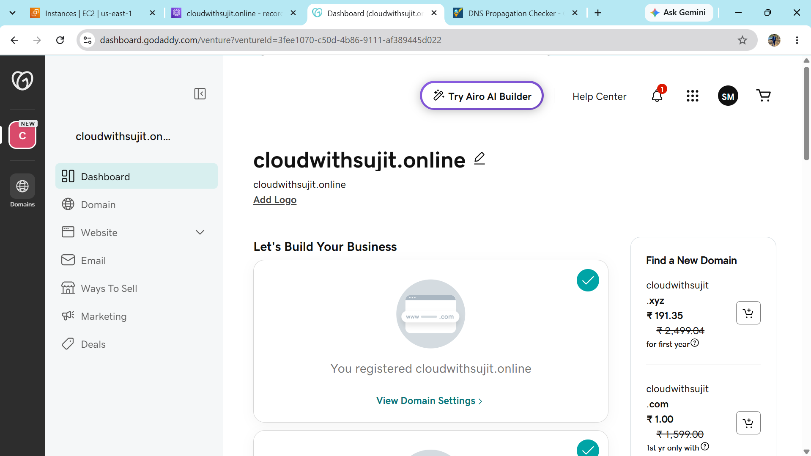
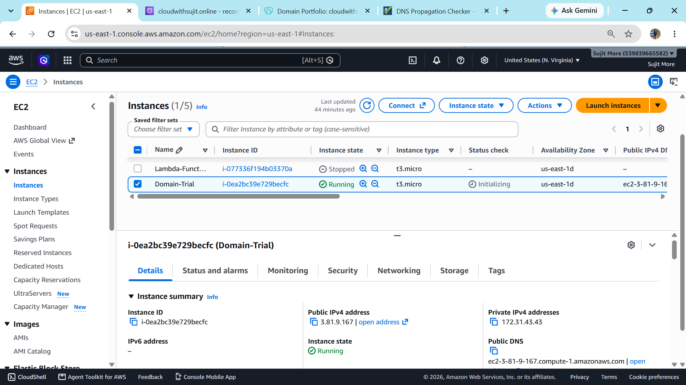
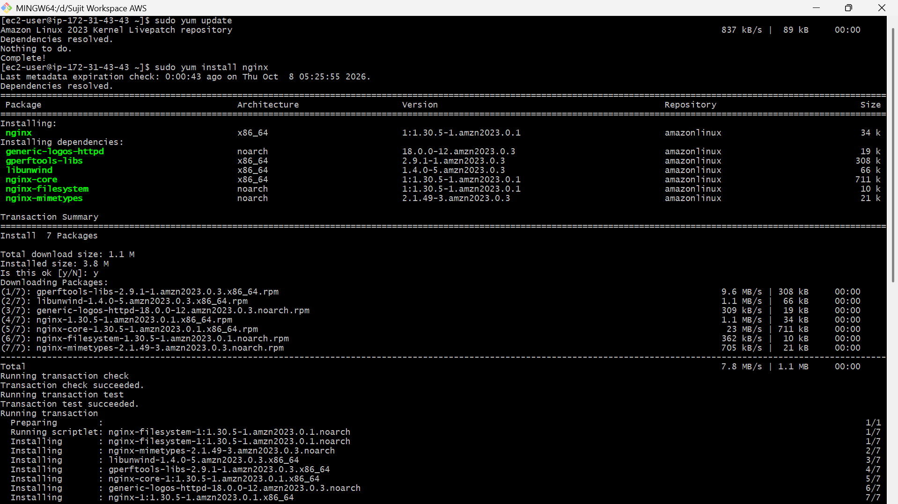
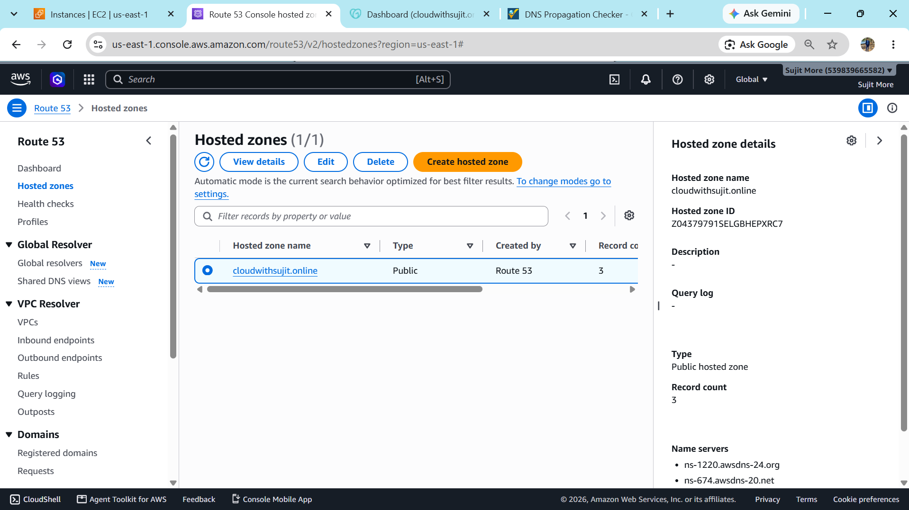
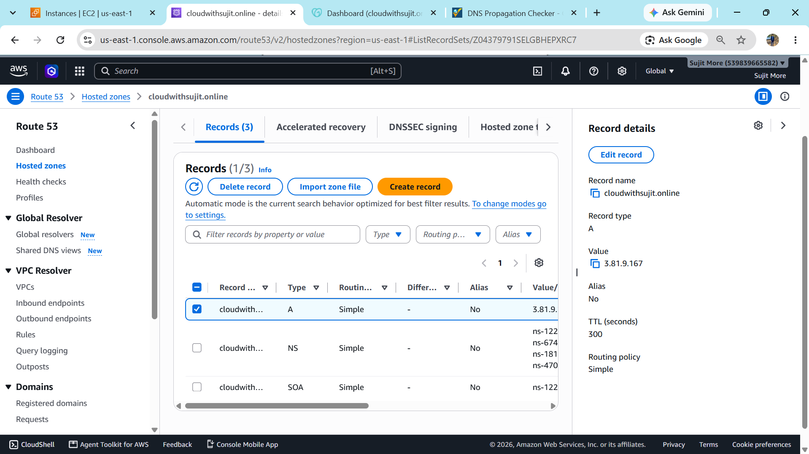
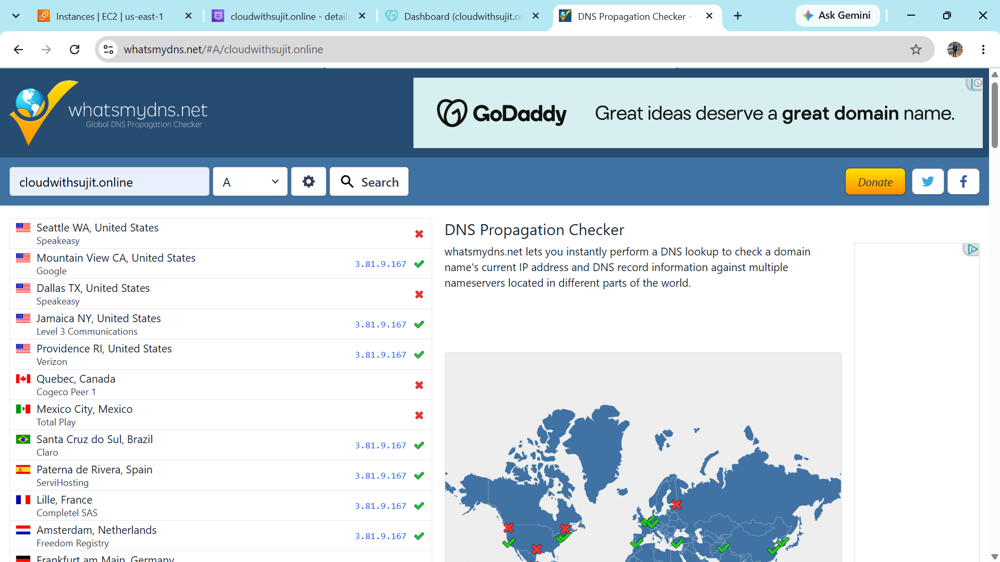
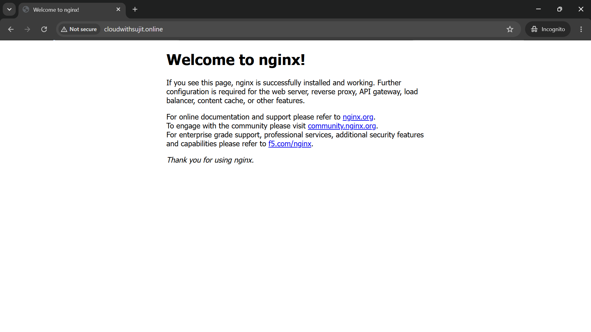

# AWS EC2 + Nginx + Route 53 + GoDaddy Domain

## Project Overview

This project demonstrates how to host a website on an **Amazon EC2 instance using Nginx** and connect a domain purchased from **GoDaddy** using **Amazon Route 53 DNS**.

The practical covers the complete flow from purchasing the domain to verifying DNS propagation globally.

## Architecture



### Architecture Flow

1. Purchase a domain from **GoDaddy**.
2. Launch an **Amazon EC2 t3.micro** instance.
3. Connect to the EC2 instance using **SSH through Git Bash**.
4. Install, start, and enable **Nginx** as the web server.
5. Create a **Route 53 Hosted Zone** for the domain.
6. Add an **A record** pointing the domain to the EC2 Public IPv4 address.
7. Update the domain's **nameservers in GoDaddy** with the Route 53 nameservers.
8. Use a **DNS propagation checker** to verify that the DNS record is resolving from different locations.
9. Access the website through the domain.

---

## AWS Services and Tools Used

| Service / Tool | Purpose |
|---|---|
| **GoDaddy** | Domain purchase and nameserver management |
| **Amazon EC2** | Hosts the web server |
| **Git Bash / SSH** | Secure connection to the EC2 instance |
| **Nginx** | Web server running on EC2 |
| **Amazon Route 53** | DNS hosting and domain resolution |
| **DNS Checker** | Verifies global DNS propagation |

---

# Step-by-Step Implementation

## 1. Purchase Domain from GoDaddy

The first step was to purchase a domain from GoDaddy and access its domain management/DNS settings.



### Action Performed

- Open GoDaddy.
- Search for an available domain.
- Purchase/register the domain.
- Open the domain management section.

---

## 2. Launch EC2 Instance

An EC2 instance was launched in AWS to act as the web server.



### Configuration

- Instance type: **t3.micro**
- Region: **N. Virginia (us-east-1)**
- Security Group configured for required traffic.
- Public IPv4 address obtained for DNS configuration.

The EC2 instance was successfully launched and reached the running state.

---

## 3. Connect to EC2 Using SSH and Install Nginx

The EC2 instance was accessed through **SSH using Git Bash on Windows**.



### Commands Used

```bash
sudo yum update
sudo yum install nginx -y
sudo systemctl start nginx
sudo systemctl enable nginx
sudo systemctl status nginx
```

After starting Nginx, the web server was configured and the setup was continued with Route 53 DNS configuration.

> **Note:** The final website access is verified through the configured domain after completing the Route 53 and GoDaddy nameserver configuration.

---

## 4. Create Route 53 Hosted Zone

Next, a Hosted Zone was created in **Amazon Route 53** for the purchased domain.



### Configuration

- Open **AWS Console → Route 53**.
- Select **Hosted zones**.
- Create a public hosted zone for the domain.
- Route 53 generates a set of authoritative nameservers for the hosted zone.

---

## 5. Add DNS A Record

An **A record** was created in the Route 53 hosted zone to point the domain to the EC2 instance's Public IPv4 address.



### Record Configuration

```text
- Record name: cloudwithsujit.online
- Record Type: A
- Value: EC2 Public IPv4 Address
- Routing Policy: Simple
```

The A record connects the domain name with the EC2 web server.

---

## 6. Update Nameservers in GoDaddy

The Route 53 nameservers were then configured in the GoDaddy domain management settings.

### Process

1. Open the domain in GoDaddy.
2. Go to DNS / domain management settings.
3. Replace the existing nameservers with the nameservers provided by Route 53.
4. Save the changes.

After this change, DNS queries for the domain are handled by the Route 53 hosted zone.

---

## 7. Verify DNS Propagation

A DNS propagation checker was used to verify whether the domain was resolving from different locations around the world.



### Verification

- Open a DNS propagation checking website.
- Enter the domain name.
- Check the **A record**.
- Verify that multiple locations return the EC2 Public IPv4 address.

This confirms that the DNS configuration has propagated successfully.

---

# Complete Workflow

```text
GoDaddy Domain Purchase
        |
        v
Amazon EC2 Instance
        |
        v
SSH using Git Bash
        |
        v
Install + Start + Enable Nginx
        |
        v
EC2 Public IPv4 Address
        |
        v
Amazon Route 53 Hosted Zone
        |
        v
Create A Record → EC2 Public IP
        |
        v
Update GoDaddy Nameservers
        |
        v
DNS Propagation
        |
        v
Website Accessible Through Domain
```

---

# Project Structure

```text
Project/
├── README.md
└── Screenshots/
    ├── Architecture.png
    ├── Domain-Purchased.png
    ├── Instance-Launched.png
    ├── Nginx-Installed-Start-Enable.png
    ├── Hosted-Zone.png
    ├── Record-added.png
    ├── DNS-Attached-Successfully.png
    └── DNS-Checker.png
```

---

# Final Result

The domain was successfully connected to the EC2 instance through **Amazon Route 53 DNS**, while **Nginx** served the website from the EC2 server.

### Website Access Through Domain

The website was successfully accessed using the configured domain name after completing the Route 53 DNS and GoDaddy nameserver configuration.



### Final Architecture

**GoDaddy Domain → Route 53 → A Record → EC2 Public IP → Nginx → Website**

---

## Key Learnings

- Launching and configuring an EC2 instance.
- Connecting to Linux EC2 using SSH and Git Bash.
- Installing and managing Nginx using `systemctl`.
- Understanding Public IPv4 addresses.
- Creating a Route 53 Hosted Zone.
- Configuring DNS A records.
- Updating domain nameservers at a registrar.
- Understanding DNS propagation and verification.

---

## Conclusion

This project demonstrates a complete basic AWS web-hosting and DNS setup using **Amazon EC2, Nginx, Route 53, and a GoDaddy-registered domain**. The DNS configuration was verified using a global DNS checker to confirm that the domain was resolving correctly.
